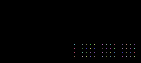

# NFT-Sign

A simple CLI tool to stamp and verify PNG images using visual signature patches

This tool allows you to:
- Write a signature patch onto a PNG image (using an Ethereum mnemonic)
- Verify a signature patch on a PNG (previously created by this tool)

Here is an (all black) image with a valid and verifiable signature patch:



## Usage

---
### Add a signature patch to an image
```
npx nft-sign 
```
Use this command to create a signature patch for a PNG image, tied to an Ethereum address.

This command first prompts you for a mnemonic (i.e. private key) of an Ethereum address.  
The image data is then hashed and signed by the given private key, and
this signature with the wallet address are combined to paint a signature patch on top of the image.

The signed image is then saved under the same name with a '.signed' sub-extension (e.g. img.signed.png)
Note: Only basic RGBA PNG images are supported at this time.

Here is a sample image with a signature patch applied to the bottom-right corner:


---
### Verify an image with a signature patch
```
npx nft-sign verify 
```

This command will verify if a signature patch is valid.

Specifically, it will extract a signature patch from the image.  
This patch is expected to contain a signature of the surrounding image data and an Ethereum address.

The patch and image are then used to confirm the following:
- the image data was signed by the Ethereum address present in the signature patch
- the signature in the signature patch is valid
- the surrounding image data is unmodified

Here is an example of the output of a successful verification:
```
$ npx nft-sign verify ./img.signed.png

Verifying: ./img.signed.png

Image hash:             9e1b20e3f20b4bd767c77c90ee0d873c9c5c431aefe6763d135f61b58e9614c2
Signature:              0x569497f7f0e9938df37da44a3f7c7e83242fc0386bb280327c2e1d8de3df446947dc7a2ca1596437e38523218f2bc9b4a86b326b6353c1545153bb734799e9ee1c
Address:                0xf56990605ebebd3dfd17e15952ad856ac544292d

Verification SUCCESS

Image was signed by:    https://etherscan.io/address/0xF56990605ebebD3DFD17E15952ad856aC544292D
```